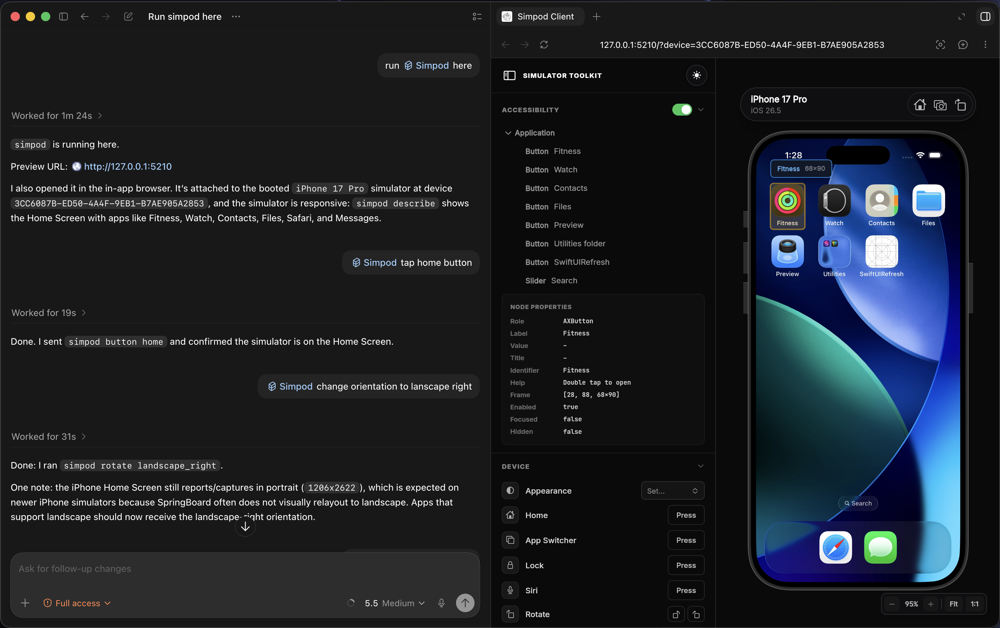

# Simpod

> Stream and control an **iOS Simulator** from your browser, terminal, or AI coding agent.

Simpod lets you remotely control an iOS Simulator from your browser, IDE, or AI agent such as **Claude Code**, **Cursor**, or **Codex**. It provides a low-latency live stream, full touch input, accessibility inspection, simulator controls, and a simple CLI—all without Xcode plugins or app instrumentation.

---



## Features

- **Low-latency streaming** (up to 60 FPS) with H.264 and automatic MJPEG fallback
- **Full simulator control**
  - Tap
  - Swipe
  - Pinch
  - Type
  - Hardware buttons
  - Rotation
- **Accessibility inspection**
  - Live accessibility tree
  - Find elements by label
  - Highlight UI elements in the browser
- **Simulator controls**
  - Light/Dark mode
  - GPS simulation
  - Status bar overrides
  - Deep links
  - Privacy permissions
- Live simulator logs
- Native device bezels from CoreSimulator
- Browser access over localhost or LAN
- Built-in **Agent Skill** for AI coding assistants

---

## Installation

### Requirements

- macOS 14+
- Xcode Command Line Tools (`xcrun simctl`)
- A booted iOS Simulator

Install using Dart:

```sh
dart pub global activate simpod
```

Then simply run:

```sh
simpod
```

Open:

```
http://127.0.0.1:5210
```

That's it.

The package already includes:

- Native Swift helper
- Flutter web dashboard

No additional downloads are required.

Alternatively, build the standalone binary:

```sh
./build.sh
```

---

## How It Works

Simpod launches a lightweight native Swift helper for each simulator.

The helper:

- Captures the simulator framebuffer
- Streams H.264 or MJPEG video
- Injects touch and keyboard events
- Reads the accessibility tree
- Exposes HTTP and WebSocket APIs

The Dart CLI manages helper processes and serves the Flutter web dashboard.

Unlike many simulator automation tools, Simpod works with **any booted simulator**—no Xcode plugin or app instrumentation required.

```text
┌──────────────┐  capture + HID   ┌─────────────────────┐   HTTP / WS   ┌─────────┐
│ iOS Simulator│ ◀──────────────▶ │ simpod-helper-bin   │ ◀────────────▶ │ Browser │
└──────────────┘                  └──────────▲──────────┘                └─────────┘
                                             │
                                             │
                                   spawns & manages
                                             │
                                   ┌─────────┴─────────┐
                                   │   simpod CLI      │
                                   │ Preview Server    │
                                   └───────────────────┘
```

---

## CLI

```text
simpod [device...]                 Start preview
simpod --detach -q                 Run in background
simpod --no-preview                Stream without browser
simpod --list                      List sessions
simpod --kill                      Stop sessions

simpod tap <x> <y>
simpod gesture '<json>'
simpod type '<text>'

simpod button [name]
simpod rotate <orientation>

simpod boot <udid>
simpod shutdown

simpod appearance light|dark
simpod open-url <url>
simpod location <lat> <lon>

simpod status-bar ...
simpod permissions ...
simpod describe
simpod logs
```

Coordinates use normalized values between **0** and **1**, where `(0,0)` is the top-left corner.

---

## Examples

```sh
# Start preview
simpod

# Run in background
simpod --detach -q

# Tap the center
simpod tap 0.5 0.5

# Type text
simpod type "Hello, world!"

# Press Home
simpod button home

# Rotate device
simpod rotate landscape_left

# Enable Dark Mode
simpod appearance dark

# Open a deep link
simpod open-url "myapp://checkout"

# Inspect the UI
simpod describe | jq

# Stop all sessions
simpod --kill
```

---

## Agent Skill

Simpod includes an **Agent Skill** that teaches AI coding agents how to operate the simulator through the CLI.

It supports:

- Taps
- Gestures
- Typing
- Hardware buttons
- Accessibility-driven interactions
- Simulator configuration
- Browser handoff

Documentation:

- `skills/simpod`
- `skills/simpod/reference`

---

## Project Structure

| Package | Language | Purpose |
|----------|----------|---------|
| `packages/native` | Swift | Simulator helper (video capture, input injection, accessibility, WebSocket server) |
| `packages/simpod` | Dart | CLI, preview server, session management |
| `packages/simpod_client` | Flutter Web | Browser dashboard |
| `packages/simpod_core` | Dart | Shared models and protocol definitions |

---

## Development

Build the native helper:

```sh
swift build -c release --package-path packages/native

cp -f packages/native/.build/release/simpod-helper-bin \
packages/simpod/lib/bin/
```

Run the CLI:

```sh
cd packages/simpod

dart pub get

dart run bin/simpod.dart
```

Run the web client:

```sh
cd ../simpod_client

flutter run -d chrome
```

Build a release binary:

```sh
./build.sh
```

The build process:

- Compiles the Swift helper
- Builds the Flutter web app
- Embeds all assets
- Produces a standalone `simpod` executable

---

## License

See the [LICENSE](LICENSE) file.